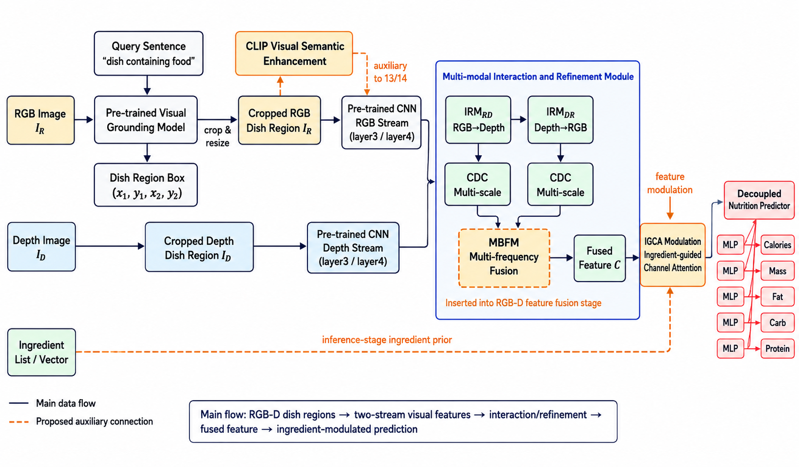

这个仓库的内容是在nianfd的研究后进行一些改进实现，原代码仓库：https://github.com/nianfd/IMIR-Net-DSP?tab=readme-ov-file

改进内容主要分三点：
1、新增MBFM模块，用于改进深度图像中的高频噪声
2、加入CLIP语义增强模块，用于提高模型理解能力
3、加入成分先验模块，用于模型实时调整预测策略

思路参考：Feng Z, Xiong H, Min W, et al. Ingredient-guided RGB-D fusion network for nutritional assessment[J]. IEEE Transactions on AgriFood Electronics, 2024, 3(1): 156-166.

